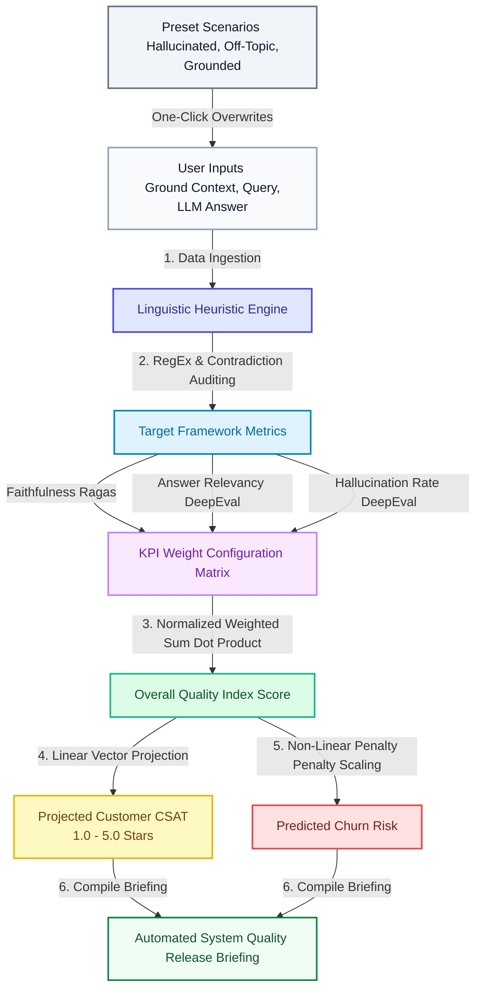

# AI Product Evals & Observability Controller

A high-fidelity dashboard engineered for AI Product Operations and Quality Assurance teams. This application acts as an interactive simulation environment to evaluate Large Language Model (LLM) responses against baseline contexts using industry-standard heuristic evaluation frameworks (**Ragas** & **DeepEval**). It predicts critical business health indicators, including **Projected Customer CSAT** and **Predicted Churn Risk**, in real time.

### 🔗 Live Link: [View Interactive App Here](https://ai-evals-and-observability-controller.streamlit.app/)

## 🚀 App Lifecycle Details

The application provides an interactive workspace split into a continuous validation pipeline:

1. **Input Ingestion (The Playground):** Users input a ground-truth source context (what the database or documentation knows), a user query, and the actual generated LLM output response. Users can also select one-click presets representing common production anomalies (e.g., *Hallucinated Fact*, *Off-Topic Response*, or *Perfect Grounding*).
2. **Heuristic AI-Judge Simulation:** Upon triggering the simulation engine, a rule-based linguistic heuristic evaluator scans the texts for numerical matches, semantic contradictions, and context alignment to automatically derive quality ratings.
3. **Weight Calibration:** Product managers calibrate individual metric weights depending on application priorities (e.g., penalizing hallucinations heavily for financial/legal bots vs. prioritizing high relevancy for creative tools).
4. **Impact Prediction:** The mathematical engine converts raw quality metrics into business-level insights: an Overall Quality Index, Churn Risk projections, and simulated 5-star CSAT metrics alongside an automated technical Release Briefing.

## 🛠️ Frameworks & Metrics

This tool simulates and adheres to metrics popularized by leading automated LLM evaluation frameworks:

### 1. Ragas Framework (Retrieval Augmented Generation Assessment)
* **Faithfulness:** Measures factual consistency. It assesses whether the facts stated in the generated LLM response are explicitly derived from and supported by the source context, catching structural fabrications.

### 2. DeepEval Framework
* **Answer Relevancy:** Quantifies how well the generated response directly answers the core user intent. It checks if the output stays on topic or includes redundant or completely unrelated fluff.
* **Hallucination Rate:** Evaluates strict contradictions where the model provides explicit answers that directly defy known ground truth information within the context block.

## 📝 Key Terminology

| Term | Definition |
| :--- | :--- |
| **Golden Dataset** | A curated collection of ground-truth context-query-response pairs used as a benchmark to grade LLM updates. |
| **LLM As A Judge** | The practice of using an advanced model (or localized heuristics) to programmatically audit, critique, and grade another model's outputs. |
| **Release Gate** | A strict quality threshold (e.g., Quality Index > 80%) that an application must pass before being deployed to production traffic. |
| **Grounding** | Ensuring an AI restricts its answers strictly to a provided set of verified facts or documents. |

## 🧮 Calculation Engine & Mathematical Logic

The metrics shown in the dashboard update instantly using a multi-layered weighted scoring system.

### 1. Overall Quality Index ($Q$)
The overall quality index combines calibrated scores against their relative impact weights via a normalized dot product formula:

$$Q = (F \cdot W_f) + (R \cdot W_r) + ((100 - H) \cdot W_h)$$

Where:
* $F$ = Faithfulness Score ($10\% - 100\%$)
* $R$ = Answer Relevancy Score ($10\% - 100\%$)
* $H$ = Hallucination Rate ($0\% - 80\%$)
* $W_f, W_r, W_h$ = Normalized Weights (such that $W_f + W_r + W_h = 1.0$)

### 2. Predicted Churn Risk ($CR$)
Customer churn increases linearly as the overall quality drops. Furthermore, a strict non-linear penalty multiplier is added if active hallucinations cross safety baselines:

* **Base Risk calculation:** $CR_{base} = (100 - Q) \times 1.5$
* **Hallucination Penalty (if $H > 15\%$):** $CR_{penalty} = (H - 15) \times 2.2$
* **Final Form:** $CR = \min(99.5\%, \max(1.5\%, CR_{base} + CR_{penalty}))$

### 3. Projected Customer CSAT
Simulates a classic 5-star user satisfaction rating linearly proportional to the System Quality Index:

$$\text{CSAT} = 1.0 + \left(\frac{Q}{100}\right) \times 4.0$$

## 🎨 How it Works (System Architecture)

## 👨‍💻 Author
Designed and engineered with precision by **Dhaval Kareliya**.

* 💼 **LinkedIn:** [Dhaval Kareliya](https://www.linkedin.com/in/dhavalk21/)
* 🐙 **GitHub Profile:** [Dhaval Kareliya](https://github.com/dhavalk21/)
